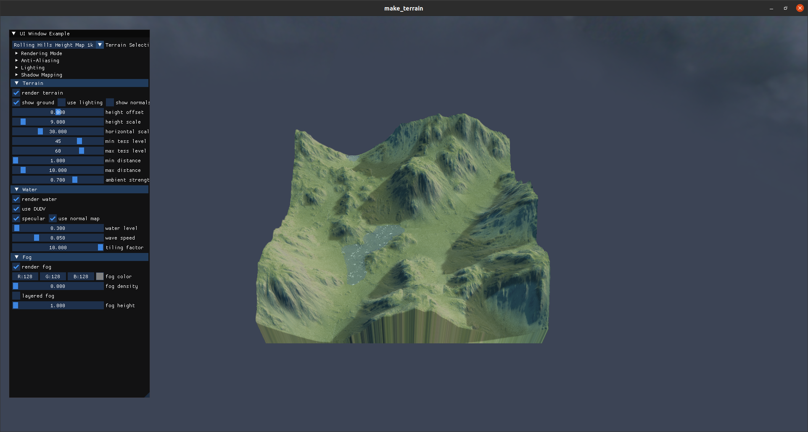
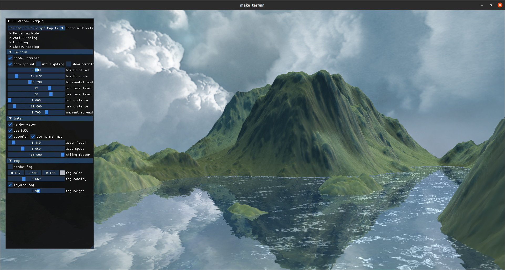

# Make terrain with OpenGL
**24-2 Graphics programming team project**

Watch our video from <a href="https://www.youtube.com/watch?v=Mm_f1qEdOP0" target="_blank">Youtube</a>!

<div style="display: flex; align-items: center; justify-content: center; gap: 10px;">
  
  
  
  
</div>




### Project Structure
```
make_terrain
├─ assets       : asset files (.obj, .png, etc.)
├─ includes     : header files (.h or .hpp)
├─ lib          : external files (not our implementations)
├─ shaders      : shader codes (.vs, .fs, etc.)
└─ src          : source files (.cpp)
```

### Build and Execution Guide
- In `Visual Studio Code`, install `CMake Tools` extention
- `ctrl + shift + p` → `Cmake: Configure`
- `ctrl + shift + p` → `Cmake: Build` (shortcut is `F7`)
- execute `./build/make_terrain`

### Build Troubleshooting
- install dependencies:
  - `sudo apt install libsoil-dev libglm-dev libassimp-dev libglew-dev libglfw3-dev libxinerama-dev libxcursor-dev libxi-dev libfreetype-dev libgl1-mesa-dev xorg-dev ninja-build libxkbcommon-x11-dev`
- compiler version
  - tested on gcc 9.4.0 

### Camera Control
- `W/S/A/D/Q/E`: camera movement
- `R`: camera rotation
- `R`: camera rotation
- `R`: camera rotation
- `R`: camera rotation
- `Mouse`: camera view direction **(right button should be pressed)**

### References
- <a href="https://www.motionforgepictures.com/height-maps/" target="_blank">Resources</a>
- <a href="https://github.com/ocornut/imgui" target="_blank">GUI</a>
- <a href="https://medium.com/@vincehnguyen/simplest-way-to-render-pretty-water-in-opengl-7bce40cbefbe" target="_blank">Simplest way to render pretty water in OpenGL</a>
- <a href="https://www.youtube.com/watch?v=BYbIs1C7rkM&t=292s" target="_blank">Mastering Fog Rendering in OpenGL</a>
